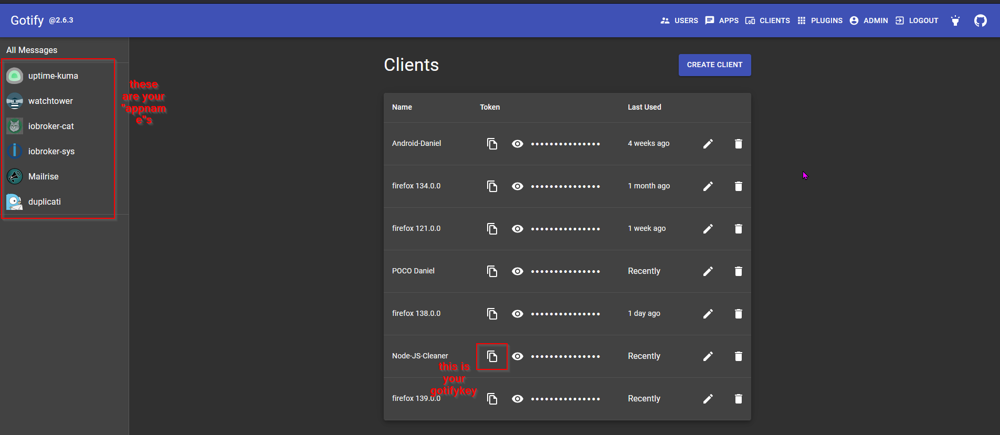

# Gotify Cleanup

<div style="text-align: center;">

</div>

This Node.js script automatically deletes old messages from your Gotify server for specified apps, keeping only the most recent ones per app.

## Features

- Periodically fetches all apps and messages from Gotify
- Keeps only the latest X messages per app (configurable)
- Supports multiple Gotify API keys (=multiple Users) and apps
- Can be run standalone or as a Docker container

## Configuration

- Either edit the `config_set/config.json` file before running the script or building the Docker image OR
- do it after deployment by logging into your container console with /bin/sh -> execute

```cmd
nano /config/config.json
```

### Example:

```json
{
  "base_url": "http://your-gotify-url:8088",
  "gotify_keys": [
    { "key": "YOUR_GOTIFY_KEY", "internalId": 1 },
    { "key": "ANOTHER_GOTIFY_KEY", "internalId": 2 }
  ],
  "intervalInSeconds": 300,
  "apps": [
    {
      "appname": "your-app",
      "mode": "keep_amount",
      "msgs2keep": 3,
      "gotify_key": 1
    },
    {
      "appname": "another-app-for -a-different-user",
      "mode": "keep_amount",
      "msgs2keep": 5,
      "gotify_key": 2
    }
  ]
}
```

## Supported Modes (`mode`)

Each app in the config can have its own `mode`. The following modes are supported:

### `keep_amount`

Keeps the newest `msgs2keep` messages, deletes all older ones.

**Example:**

```json
{
  "appname": "my-app",
  "mode": "keep_amount",
  "msgs2keep": 3,
  "gotify_key": 1
}
```

---

### `keep_unique`

Keeps only one message per unique content (e.g., title or message).  
**Note:** This mode is experimental/buggy.

**Example:**

```json
{
  "appname": "unique-app",
  "mode": "keep_unique",
  "gotify_key": 2
}
```

---

### `delete_filtered`

Deletes all messages that contain any of the specified substrings.

**Example:**

```json
{
  "appname": "delete-by-substring",
  "mode": "delete_filtered",
  "substrings": ["delete explicitly", "only me"],
  "gotify_key": 1
}
```

---

### `keep_filtered`

Keeps only messages that contain any of the specified substrings, deletes all others.

**Example:**

```json
{
  "appname": "keep-by-substring",
  "mode": "keep_filtered",
  "substrings": ["keep", "only me"],
  "gotify_key": 1
}
```

---

### `uptime-kuma`

Special mode for Uptime-Kuma notifications. Messages are grouped by the title (the text between `[` and `]`). For each title, the script keeps the last `msgs2keep` value pairs (`up`/`down`), deleting older pairs. If there are more "down" than "up" entries, the extra "down" entry is kept, even if msgs2keep is set to 0.

**Example:**

```json
{
  "appname": "Uptime Kuma",
  "mode": "uptime-kuma",
  "msgs2keep": 2,
  "gotify_key": 1
}
```

---

**Notes:**

- The mode is set per app.
- Not every mode requires all fields (e.g., `substrings` is only needed for `*_filtered` modes).
- `gotify_key` refers to the corresponding key object in `gotify_keys`.

- `base_url`: URL of your Gotify server
- `gotify_keys`: List of API keys with unique internal IDs (you need 1 per user)
- `intervalInSeconds`: How often the cleanup runs
- `apps`: List of apps to clean up, with how many messages to keep and which key to use

### Getting your keys for your config

The visibility of your apps is user-based in gotify, so you need at least one gotify_key for your Instance. If an application is registered to another user on your instance, you need a second one, and so on.
Heres, where you can find the values:



## Deployment

### Standalone

Install dependencies and run:

```bash
npm install
node index.js
```

### Docker

Build and run the container:

with `docker-compose`:

```yaml
services:
  gotify-cleanup:
    image: sproove/gotify-cleanup:latest
    container_name: gotify-cleanup
    restart: unless-stopped
    volumes:
      - gotify_cleanup_config:/app/config
volumes:
  gotify_cleanup_config:
    name: gotify_cleanup_config
```

or manually

```bash
./build_and_package.sh
# or manually:
docker build -t gotify-cleanup .
docker run -v $(pwd)/config_set:/app/config gotify-cleanup
```

## Notes

- The script will only copy the example config to `/app/config/config.json` if it does not exist yet.
- Edit your config on the host in `config_set/config.json` for persistent changes.
- The container includes `nano` for editing files inside the container if needed.

## License

MIT
